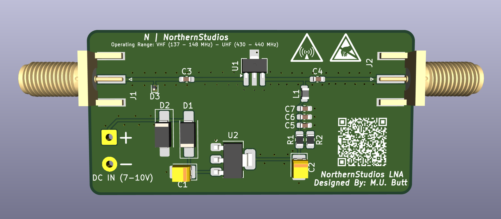

# NorthernStudios Wideband VHF/UHF Low-Noise Amplifier

  

  <b>Designed by: Muhammad Uzzam Butt // NorthernStudios</b>

  
  
  

---

## Overview

The **NorthernStudios Wideband VHF/UHF Low-Noise Amplifier (LNA)** is an open-source, high-linearity RF preamplifier designed for weak-signal reception across the VHF and UHF bands. Built around the Qorvo / RFMD SPF5189Z GaAs pHEMT MMIC, it operates as an unfiltered wideband gain block with active drain biasing, multi-stage supply rail decoupling, and dedicated input ESD protection.

The board is tailored for satellite telemetry decoding (such as 137 MHz NOAA APT / Meteor-M LRPT and 435-438 MHz CubeSats), amateur radio communications on the 2m (144-148 MHz) and 70cm (430-440 MHz) bands, and general-purpose wideband Software Defined Radio (SDR) receiver front-ends.

The RF signal paths use 50-ohm single-ended coplanar waveguide (CPW) geometry with continuous via fences and stripped copper perimeter borders on the top and bottom layers, allowing direct slide-in mounting into standard extruded aluminum shielding enclosures.

---

## Hardware Specifications

### RF & Electrical Performance

| Parameter | Specification | Notes |
| :--- | :--- | :--- |
| **Optimized Tuning Band** | 130 MHz - 450 MHz | Weather satellite and VHF/UHF amateur radio spectrum |
| **Operational Bandwidth** | 50 MHz - 4000 MHz | Unfiltered MMIC frequency range |
| **VHF Gain** | ~18.5 dB | Measured at 144 MHz |
| **UHF Gain** | ~18.0 dB | Measured at 435 MHz |
| **Noise Figure (NF)** | ~0.60 dB | Typical across VHF and UHF bands |
| **Port Impedance** | 50 ohm nominal | Matched RF input (J1) and output (J2) |
| **Input ESD Tolerance** | +/- 30 kV air / +/- 30 kV contact | IEC 61000-4-2 standard via onboard low-capacitance clamp |

### Linearity by Operating Mode

| Metric | High-Dynamic-Range Mode (5.0V Bias) | Safe Thermal Mode (3.3V Bias) |
| :--- | :--- | :--- |
| **Drain Voltage (V_D)** | +5.0 V DC | ~3.3 V DC |
| **Current Consumption** | ~90 - 95 mA | ~80 mA |
| **Device Dissipation** | ~450 mW | ~264 mW |
| **Output P1dB** | +22.7 dBm | ~ +18 dBm |
| **Output IP3 (OIP3)** | +39.5 dBm | ~ +34 dBm |
| **Configuration** | Install two 0-ohm jumpers at R1 and R2 | Install two 39-ohm resistors in parallel at R1 and R2 |

---

## Circuit Architecture

### RF Signal Path
* **DC Blocking**: 1 nF (1000 pF) 0603 C0G/NP0 ceramic capacitors (C3 and C4) isolate the input and output RF ports while presenting minimal series reactance (Xc ~ 1.1 ohm at 144 MHz, ~ 0.37 ohm at 435 MHz).
* **Active Bias Choke**: High-Q wirewound ceramic-core inductor (L1, 470 nH to 1.0 uH) injects DC drain current at MMIC Pin 3 with a self-resonant frequency (SRF) exceeding 500 MHz to prevent in-band signal leakage.
* **ESD Clamping**: Nexperia PESD5V0U1BL bidirectional ESD clamp diode (D3, SOD-882) located at the input port shunts high-voltage transients up to +/- 30 kV. Its ultra-low diode capacitance (Cd ~ 1.5 pF) maintains input match and avoids degrading noise figure.

### Power Regulation & Protection
* **DC Input (J3)**: Accepts +7.0 V to +10.0 V DC via screw terminal block or standard 0.1-inch (2.54 mm) pin header.
* **Linear LDO**: AMS1117-5.0 (U2) in a SOT-223 package steps down input supply to a clean, ripple-free +5.0 V DC rail.
* **Reverse Polarity Protection**: Series SS34 Schottky barrier diode (D1) on the positive rail prevents reverse-current damage. A secondary shunt SS34 diode (D2) clamps reverse spikes at the input terminal.
* **Multi-Decade Decoupling Ladder**: A combination of bulk 22 uF polarized tantalum capacitors (C1, C2) and parallel ceramic bypass capacitors (C7: 100 nF X7R, C6: 10 nF X7R, C5: 100 pF C0G) isolates the active device from power supply noise across low, intermediate, and high RF frequencies.

### Selectable Thermal / Linearity Biasing
The board features a dual parallel 0805 resistor footprint (R1 || R2) between the 5V LDO output and the RF bias choke:
* **High-Dynamic-Range Mode**: Solder two 0-ohm jumpers in place of R1 and R2. The MMIC runs directly at 5.0 V / 90 mA for maximum linearity (+39.5 dBm OIP3), suitable for high-interference environments with adequate enclosure heatsinking.
* **Safe Thermal Mode**: Solder two 39-ohm resistors in parallel (19.5 ohm net resistance). This drops the drain voltage to ~3.3 V and reduces active MMIC power dissipation from 450 mW to 264 mW, lowering operating temperatures significantly when operating without active cooling.

---

## Critical Components (Bill of Materials)

| Reference | Value / Part | Footprint | Function / Description |
| :--- | :--- | :--- | :--- |
| **U1** | SPF5189Z | SOT-89-3 | High-linearity GaAs pHEMT low-noise MMIC amplifier |
| **U2** | AMS1117-5.0 | SOT-223-3 | +5.0V fixed linear low-dropout voltage regulator |
| **D1, D2** | SS34 | DO-214AC (SMA) | 3A / 40V Schottky barrier diodes (series protection D1, shunt clamp D2) |
| **D3** | PESD5V0U1BL | SOD-882 | Ultra-low capacitance (1.5 pF) bidirectional ESD clamp diode |
| **C1, C2** | 22 uF / 16V | EIA-3528-21 (Case-B) | Polarized tantalum capacitors for DC bulk input and output filtering |
| **C3, C4** | 1 nF (1000 pF) | 0603 | C0G / NP0 dielectric RF DC blocking capacitors |
| **C5** | 100 pF | 0603 | C0G dielectric RF high-frequency decoupling capacitor |
| **C6** | 10 nF | 0603 | X7R dielectric intermediate frequency bypass capacitor |
| **C7** | 100 nF | 0603 | X7R dielectric low-frequency bypass capacitor |
| **L1** | 470 nH - 1.0 uH | 0805 | Wirewound ceramic-core RF bias inductor (SRF > 500 MHz) |
| **R1, R2** | 39 ohm or 0 ohm | 0805 | Parallel bias ballast resistors (39 ohm for thermal mode, 0 ohm for HDR mode) |
| **J1, J2** | 50-ohm SMA Female | End-Launch Edge Mount | RF input (J1) and RF output (J2) edge-mount coaxial connectors |
| **J3** | DC Power Input | 5.08 mm / 2.54 mm | 2-pin screw terminal block or pin header (7-10V DC input) |

---

## PCB Layout & Mechanical Details

* **RF Transmission Lines**: 50-ohm single-ended coplanar waveguide (CPW) calculated for standard 1.6 mm FR-4 dielectric thickness with ground stitching vias on both sides of the trace.
* **Shielding Via Fence**: Close-pitch ground via fencing surrounds the RF trace runs to suppress parasitic substrate resonances and minimize crosstalk with the DC regulation section.
* **Thermal Relief**: A 4-via thermal array is integrated directly inside the SOT-89 center ground slug pad, sinking heat into internal and bottom ground planes.
* **Enclosure Contact**: 1.5 mm wide solder mask openings along the top (`F.Mask`) and bottom (`B.Mask`) perimeter edges expose bare copper for direct electrical contact with standard CNC extruded aluminum shielded enclosures.
* **Connector Clearance**: End-launch SMA connectors align flush with the board edge notches for slide-in assembly into shielded housings.

---

## Assembly Notes

* **Reflow Requirements**: The SOD-882 package for ESD protection diode D3 has bottom-only contact pads and requires solder paste with hot-air reflow or a hot plate for proper soldering.
* **Hand Soldering**: All remaining SMD parts (0603 passives, 0805 components, SOT-89, SOT-223, DO-214AC, Case-B tantalum capacitors, and SMA connectors) include extended solder pads for manual assembly with a fine-tip soldering iron.
* **Flux Cleaning**: Residual rosin or active flux along the RF path (C3, D3, U1, C4, and L1) will increase insertion loss and degrade the noise figure. Clean the board thoroughly with isopropyl alcohol (IPA) after soldering.

---

## Repository Structure

* [`LNA/`](LNA): KiCad design files
  * [`LNA.kicad_pro`](LNA/LNA.kicad_pro): KiCad project configuration
  * [`LNA.kicad_sch`](LNA/LNA.kicad_sch): Schematic sheet
  * [`LNA.kicad_pcb`](LNA/LNA.kicad_pcb): PCB layout and routing
* [`Pic.png`](Pic.png): 3D board render preview
* [`Schematic.pdf`](Schematic.pdf): Complete schematic in PDF format

---

## License

This project is licensed under the [MIT License](LICENSE).
